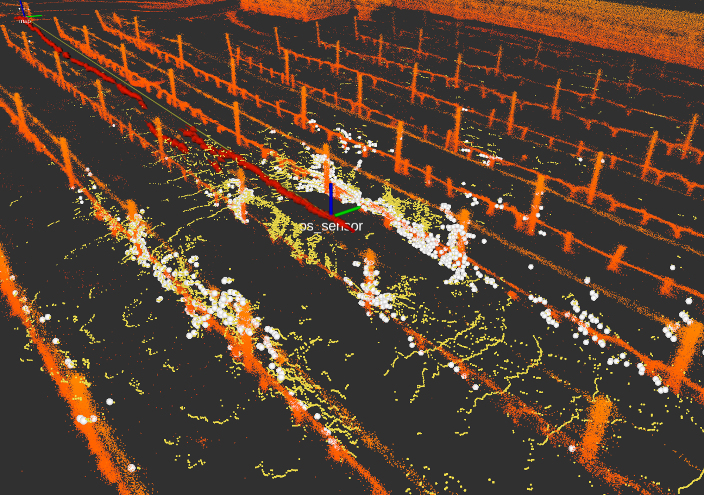

# LTS-filter Docker



Docker configuration for the long-term stability points filter. 

To use the Dockerfile, first run to build the filter image.

```bash
./build_docker.sh
```

To run the docker node, please set the following params: 
* ROS_MASTER_URI: (default: http://Mars:11311/)
* RAW_CLOUD: raw point cloud topic (default: /os_cloud_node/points)
* FILTERED_CLOUD: filtered point cloud topic (default: /cloud_filtered)
* EPSILON_0: bottom threshold used to filter the ground points (default: 0.04)
* EPSILON_1: upper threshold used to filter the dynamic points (default: 0.85)

The params could be either set in the __run_docker.sh__ or could be passed as args as follows:

```bash
./run_docker.sh -U <ROS_MASTER_URI> -R <RAW_CLOUD> -G <EPSILON_0> -D <EPSILON_1>
```
